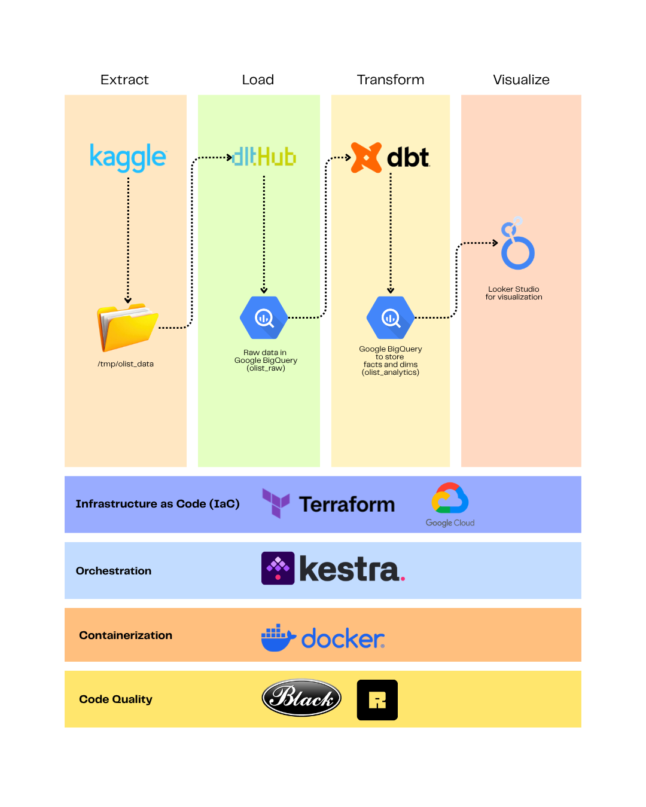
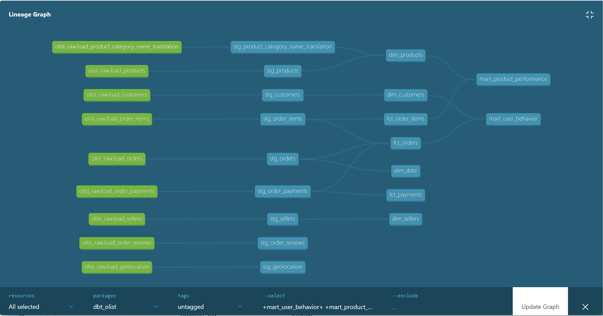
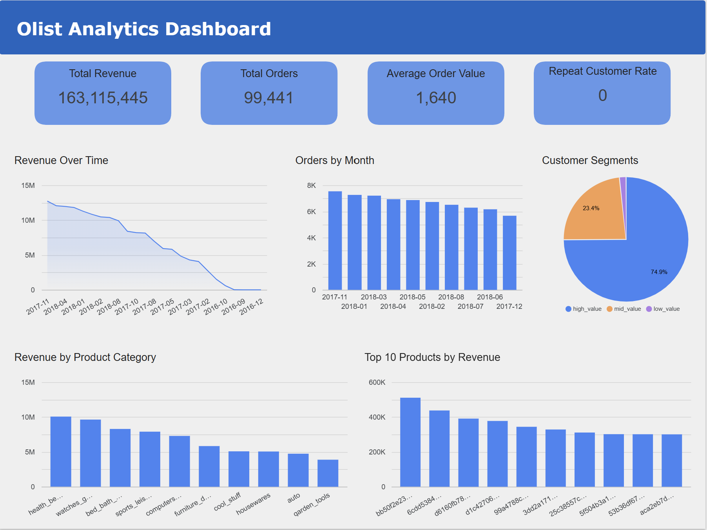

# 📊 E-Commerce Behavioral Analytics Platform

## 🚀 Overview
This project builds an end-to-end ELT (Extract, Load, Transform) **cloud-native analytics platform** to analyze customer and product behavior using the [Olist e-commerce dataset](https://www.kaggle.com/datasets/olistbr/brazilian-ecommerce). The goal is to transform raw transactional data into **analytics-ready datasets** that support business insights such as customer retention, purchase behavior, and product performance.

The platform follows a modern data stack approach, combining data ingestion, distributed processing, transformation, and orchestration to deliver reliable and scalable analytics.

---

## 🎯 Problem Description
E-commerce platforms generate large amounts of transactional data, but raw data alone does not provide actionable insights.  

This project addresses the challenge of:
- Understanding **customer behavior** (repeat purchases, spending patterns)
- Identifying **high-performing products and categories**
- Enabling **data-driven decision making** through structured analytics models and dashboards  

By building an end-to-end pipeline, this project demonstrates how raw data can be transformed into meaningful business insights.

---

## 🧱 Architecture
Kaggle Dataset (via Kaggle API) --> dlt ingestion --> BigQuery Raw --> dbt transformations --> BigQuery Mart --> Looker Studio Dashboard



---

## ⚙️ Tech Stack
| Layer              | Tools            |
| ------------------ | ---------------- |
| Ingestion          | Kaggle API + dlt |
| Transformation     | dbt              |
| Orchestration      | Kestra           |
| Data Warehouse     | BigQuery         |
| Infrastructure     | Terraform        |
| Containerization   | Docker           |
| Visualization      | Looker Studio    |
| Environment        | GCP VM + uv      |

---

## 📦 Dataset
- Source: [Olist E-Commerce Dataset (Brazilian marketplace)](https://www.kaggle.com/datasets/olistbr/brazilian-ecommerce)
- Tables include:
  - customers
  - geolocation
  - order_items
  - order_payments
  - order_reviews
  - orders
  - product_category_name_translation
  - products
  - sellers

---

## 🧮 Data Modeling
The data is modeled using a **dimensional modeling** approach with a star schema design.

### 🔹 Fact tables
- `fct_orders`
- `fct_order_items`
- `fct_payments`

### 🔹 Dimension tables
- `dim_customers`
- `dim_products`
- `dim_sellers`
- `dim_date`

### 🔹 Marts tables
-  `mart_user_behavior`
  - Customer-level aggregation
  - Metrics:
    - total_orders
    - total_spent
    - avg_order_value
    - days_since_last_order
    - repeat customer flag

- `mart_product_performance`
  - Product-level aggregation
  - Metrics:
    - total_orders
    - total_revenue
    - avg_price
    - product category




---

## ⚡ Data Warehouse Optimization
- **Partitioning:**
  - `fact_orders` partitioned by `order_purchase_timestamp`
- **Clustering:**
  - Clustered by `customer_id`

This improves query performance and reduces cost.

---

## 🚀 Pipeline Workflow
### Infrastructure
- Terraform provisions GCP resources (BigQuery, GCS, VM)
### Ingestion
- Kaggle API download the dataset and dlt loads raw CSV data into BigQuery (`olist_raw`)
### Transformation
- dbt builds staging models, fact/dimension tables and marts
### Orchestration
- Kestra schedules and runs workflows
### Serving
- Data is exposed to Looker Studio dashboards

---

## 🔄 Orchestration (Kestra)
The pipeline automates:
- dlt ingestion
- dbt runs 
- dbt tests

---

## 📊 Dashboard
The dashboard is built on a **star schema** with fact and dimension tables and provides business insights accross revenue, customer, and product.
### Business Overview
- Total revenue
- Total orders
- Average order value
- Revenue trend across time
These metrics are powered by the `fact_orders` table and show overall business performance and growth.

### Customer Behavior
- Repeat customer rate
- Customer segmentation (high/mid/low value)
Built from `mart_user_behavior` and `dim_customers`, enabling: customer value segmentation and behavioral insights.

### Product Performance
- Revenue by product category
- Top products by revenue
Powered by `fact_order_items` and `dim_products`, answering: which categories drive revenue and which products perform best.

---

## 📸 Dashboard Preview



---

## 🔐 Required Setup
This project requires **external credentials**.
1. **Kaggle API Key**
  - Go to your Kaggle account settings
  - Click "Create New API Token"
  - Move the file, e.g.:
    ```bash
    mkdir -p ~/.kaggle
    mv ~/Downloads/kaggle.json ~/.kaggle/
    chmod 600 ~/.kaggle/kaggle.json
    ```

2. **GCP Service Account Key**
  - Create a Service Account in GCP
  - Grant roles:
    - BigQuery Data Editor
    - BigQuery Job User
  - Download the JSON key
  - Place it somewhere safe, e.g.:
    ```bash
    mkdir -p ~/elt-ecommerce/.gcp
    mv ~/Downloads/your-key.json ~/elt-ecommerce/.gcp/
    ```

3. **Set Environment Variable**
  ```bash
  export GOOGLE_APPLICATION_CREDENTIALS=~/elt-ecommerce/.gcp/your-key.json
  ```

---
## 🛠️ How to Run
### 1. Clone Repository
```bash
git clone https://github.com/deedeepratiwi/olist-analytics-platform.git
cd olist-analytics-platform
```

### 2. Install Dependencies
```bash
uv venv
uv sync
```

### 3. Provision infrastructure
cd terraform
terraform init
terraform apply

### 4. Run Data Ingestion (dlt)
```bash
uv run python dlt-pipeline/dlt_pipeline.py
```

### 5. Run Transformations (dbt)
```bash
cd dbt-olist
uv run dbt run
uv run dbt test
```

### 6. (Optional) Run Tests (dbt)
```bash
uv run dbt test
```

---

## 📌 Key Learnings
- Building end-to-end ELT pipelines
- Designing dimensional models
- Using dbt for analytics engineering
- Orchestrating workflows with Kestra
- Optimizing BigQuery performance with partitioning and clustering
- Applying PySpark for large-scale transformations
- Creating business-focused dashboards

---

## 📈 Future Improvements
- Implement data quality monitoring dashboards
- Extend models for recommendation systems